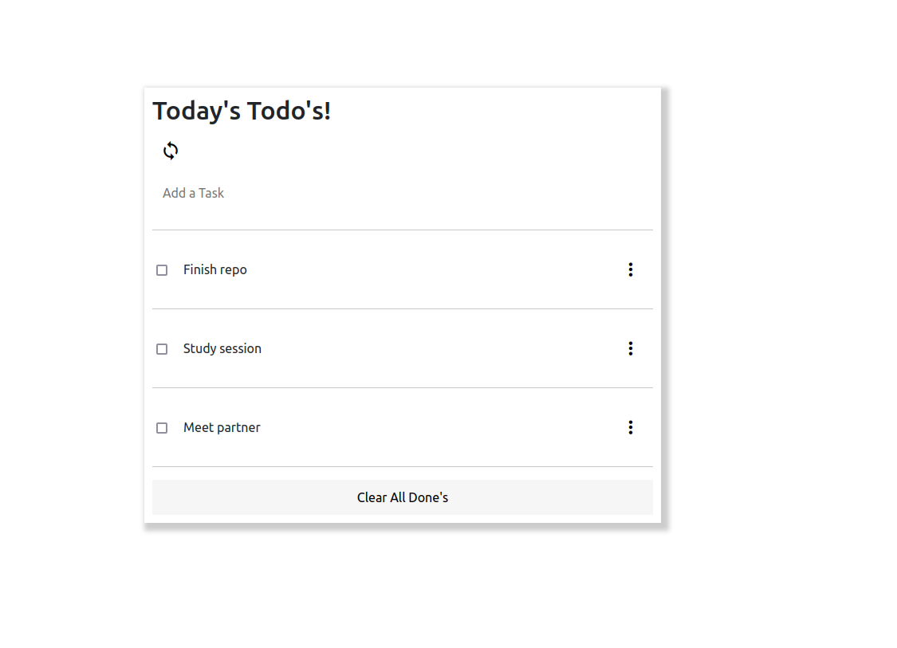

# To Do List

In this project, I build a simple HTML list of To Do tasks. The list will be styled and will be built using webpack and served by a webpack dev server.

Additional description about the project and its features.

## Built With

- Java Script 
- HTML CSS
- Webpack and webpack dev server

## Live Demo

[Live Demo Link](https://angelacuahutle.github.io/To-Do-List/dist)

## Getting Started

**Setup Webpack locally and start coding!Use the following tutorial: https://webpack.js.org/guides/getting-started/**

- Set up a new project with webpack
- Create an index.html file and write your HTML markup here. Create an empty To Do List placeholder (
 or <ul> element). The index.html file must be set as a template using the HTML Webpack Plugin.
- Create an index.js file and set an array of some simple to do tasks (array of objects). Each task object should contain three keys:
description [string].
completed [bool].
index: [number].
- Write a function to iterate over the tasks array and populate an HTML list item element for each task.
- On page load render the dynamically created list of tasks in the dedicated placeholder. The list should apear in order of the index values for each task.
- Create a style.css and set rules for the To Do List. CSS must be loaded by Webpack Style/CSS Loader.
- Add a new JavaScript files and import it as a module:
it will contain methods related to the status updates (completed: true / false).
- Add event listener to the checkbox (change).
- Update items object's value for completed key upon user actions.
- Store the updated array of items in local storage, so the user gets the correct list values after the page reloads.

- Run the following commands to turn the server on: npm start 

### Prerequisites

## Setup Webpack

## Authors

👤 **Author**

- GitHub: [@angelaciuahutle](https://github.com/angelacuahutle)
- Twitter: [@angelaCunadev](https://twitter.com/angelaCunaDev)
- LinkedIn: [LinkedIn](https://linkedin.com/in/angelacuahutle)

## 🤝 Contributing

Contributions, issues, and feature requests are welcome!

Feel free to check the [issues page](https://github.com/angelacuahutle/To-Do-List/issues).

## Show your support

Give a ⭐️ if you like this project!

## 📝 License

This project is [MIT](./MIT.md) licensed.
